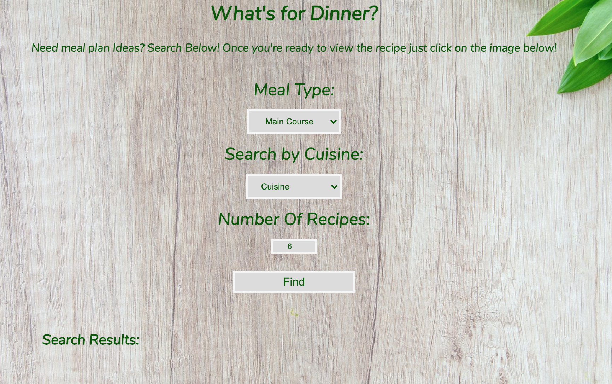
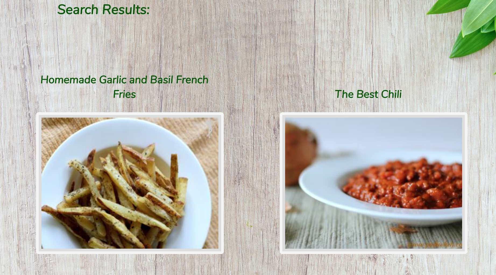
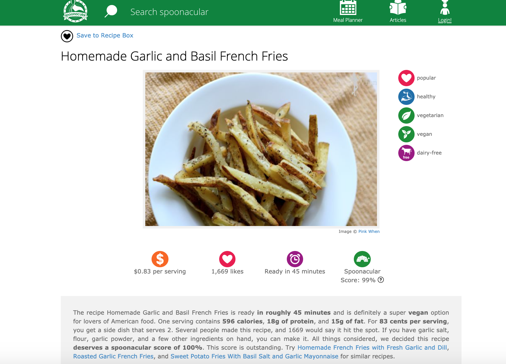

## What's for Dinner?

**Introduction**
What's for Dinner is a web application to help you search for meal plan ideas by different cuisines.

A live version of the application can be found at: https://jonatoj.github.io/What-s-For-Dinner/.

**Current live version: 1.0

## Requirements
* A web browser.
* An active internet connection.
* User Instructions.
* Select a Cuisine from the list and number of images to display.

#

Select one of twenty six cuisines displayed and select number of recipes to display
or use default number of recipes/image.

Then click the image to display the recipes information.

## Planned Development

* Allow the user to select one of twenty six different cuisines
* Allow the user to scroll through all the recipe/image results.
* Allow the user to click on a image to view the recipe information.

#

## Technology Used

* HTML
* CSS
* JavaScript/JQuery
* Spoonacular Food API

#
## Credits

Spoonacular
https://spoonacular.com/food-api

## Author
Jonathan Toj
